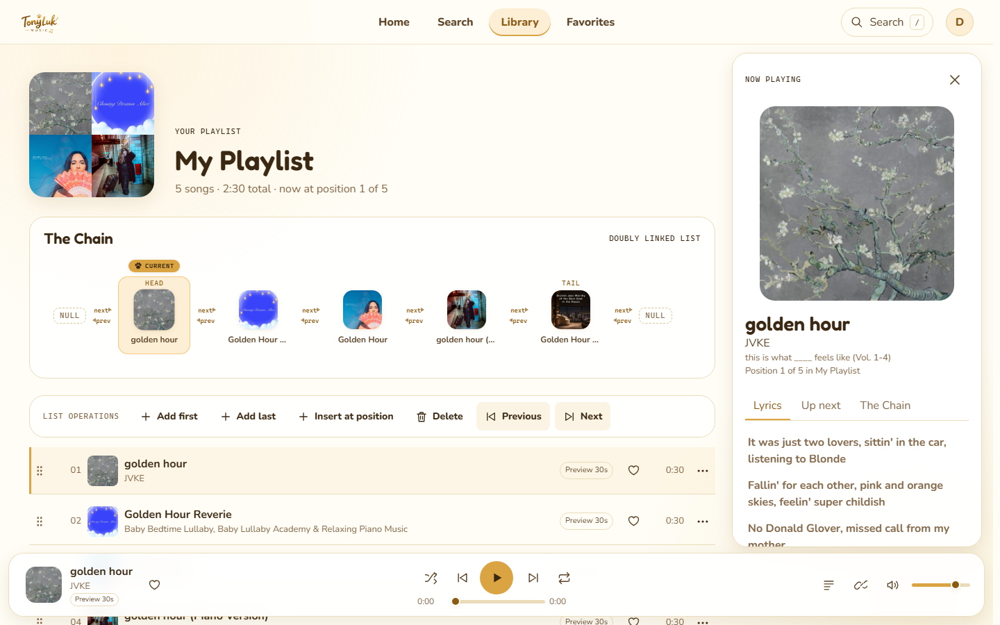
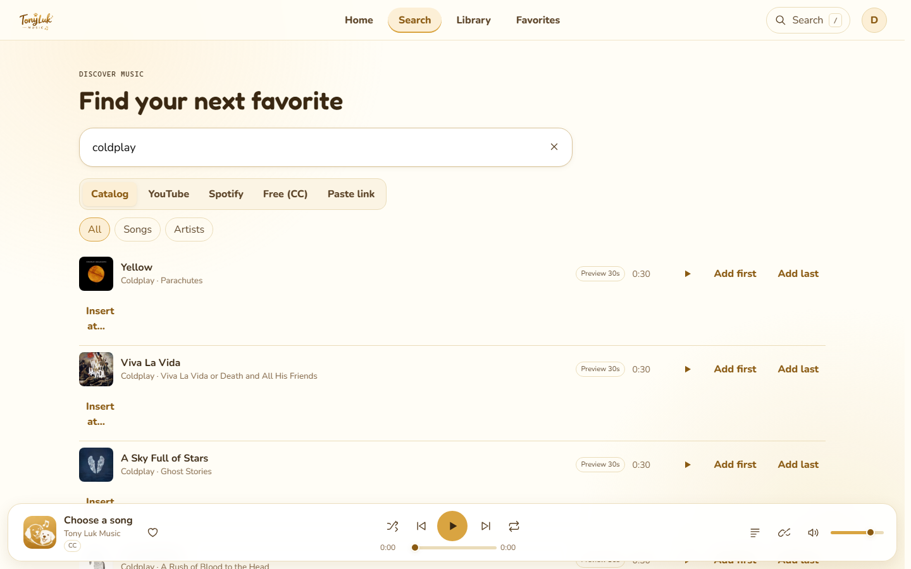
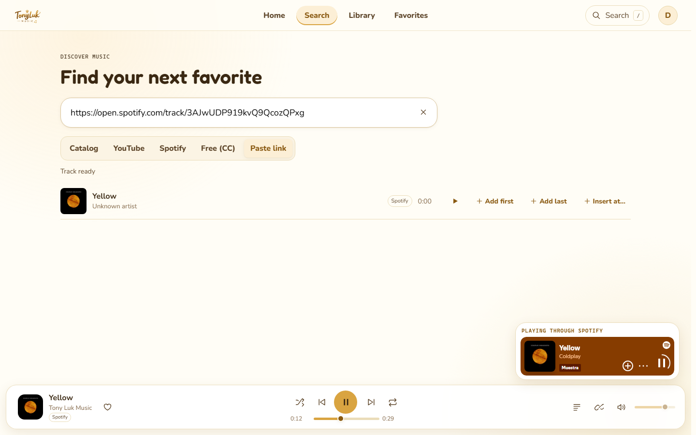
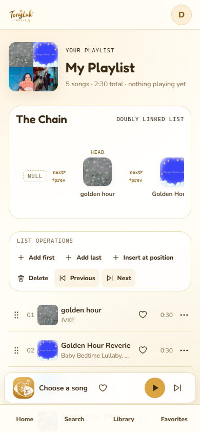

# Tony Luk Music

Reproductor de música web en TypeScript. Cada playlist es una **lista doblemente enlazada** escrita a mano.

El nombre viene de Tony (un golden retriever) y Lucky (un perrito blanco). Sus tonos dorados, crema y blancos definen toda la identidad visual.


## Objetivo académico

Trabajo universitario sobre **listas doblemente enlazadas** aplicadas a un reproductor de música real. La playlist no es un arreglo: cada canción vive en un nodo con punteros `prev` y `next`, y el reproductor avanza o retrocede siguiendo esos punteros.

Operaciones pedidas por el profesor, todas visibles desde la interfaz:

| Operación | Método de la lista | Complejidad | Dónde se ve en la app |
|---|---|---|---|
| Agregar al inicio | `addFirst(song)` | O(1) | Botón **Add first** |
| Agregar al final | `addLast(song)` | O(1) | Botón **Add last** |
| Agregar en cualquier posición | `insertAt(index, song)` | O(n) | Botón **Insert at position** |
| Eliminar una canción | `delete(node)` | O(1) | Botón **Delete** o menú de la fila |
| Siguiente canción | `current = current.next` | O(1) | Botón **Next** |
| Canción anterior | `current = current.prev` | O(1) | Botón **Previous** |

## La lista doblemente enlazada

### Las piezas

```ts
class ListNode<T> {            // SongNode = ListNode<Song>
  value: T;                    // la canción
  prev: ListNode<T> | null;    // nodo anterior
  next: ListNode<T> | null;    // nodo siguiente
}

class DoublyLinkedList<T> {
  head: ListNode<T> | null;     // primer nodo
  tail: ListNode<T> | null;     // último nodo
  current: ListNode<T> | null;  // la canción que está sonando
  size: number;                 // cantidad de nodos (también `length`)
}
```

Código: [`src/core/doublylinked.ts`](src/core/doublylinked.ts). El tipo `Song` y el alias `SongNode` están en [`src/core/song.ts`](src/core/song.ts).

### Forma de la lista

```
null <- Canción A <-> Canción B <-> Canción C -> null
        ^head                       ^tail
```

Reglas que siempre se cumplen (invariantes):

- `head.prev` siempre es `null` y `tail.next` siempre es `null`.
- Para cada nodo `n` que tenga siguiente: `n.next.prev === n`.
- Lista vacía: `head`, `tail` y `current` son `null` y `size` es `0`.
- Lista de una sola canción: `head === tail` y ese nodo tiene `prev = next = null`.

### Agregar al inicio (Add First)

```
antes:            head
                   v
          null <- [B] <-> [C] -> null

addFirst(A):  nuevo.next = head;  head.prev = nuevo;  head = nuevo

después:  null <- [A] <-> [B] <-> [C] -> null
```

Si la lista estaba vacía, el nuevo nodo pasa a ser `head` y `tail` a la vez.

### Agregar al final (Add Last)

Es el espejo de Add First usando `tail`: `nuevo.prev = tail; tail.next = nuevo; tail = nuevo`.

### Insertar en una posición (Insert At)

1. Si `i === 0` se usa Add First. Si `i === size` se usa Add Last. Si está fuera de rango se lanza `RangeError`.
2. Si no, se busca el nodo que hoy está en la posición `i`. Se camina desde el extremo más cercano (`head` o `tail`), así que son como mucho `n/2` pasos.
3. Se enlaza el nuevo nodo entre ese nodo `X` y su anterior `P`:

```
[P] <-> [X]               nuevo.prev = P;  nuevo.next = X
              ==>         P.next = nuevo;  X.prev = nuevo
[P] <-> [nuevo] <-> [X]
```

### Eliminar (Delete)

```
[P] <-> [X] <-> [N]       P.next = N;  N.prev = P;  X.prev = X.next = null
              ==>
[P] <-> [N]
```

- Si se borra el `head`, `head` pasa a ser `N`. Si se borra el `tail`, `tail` pasa a ser `P`.
- Si el nodo borrado era `current`, `current` pasa a `N`; si no hay `N`, a `P`; si no hay ninguno, queda en `null` (la lista quedó vacía).
- En la app, después de borrar aparece **Undo**, que vuelve a insertar la canción en la misma posición con `insertAt`.

### Siguiente y Anterior: cómo el reproductor usa los punteros

El reproductor ([`src/core/player.ts`](src/core/player.ts)) guarda su posición en el puntero `current` de la lista:

```ts
next():  current = current.next   // en el tail no hay siguiente: se detiene (o vuelve al head con Repeat All)
prev():  current = current.prev   // en el head no hay anterior: se detiene (o va al tail con Repeat All)
```

Las dos operaciones son **O(1)**: el reproductor nunca busca dentro de la lista, solo sigue un puntero. Por eso se usa una lista **doblemente** enlazada. Con una lista simple no existe `prev`, y para retroceder habría que recorrer desde `head` (O(n)).

Comportamientos extra construidos encima:

- **Repeat One** devuelve el mismo `current`.
- **Repeat All** salta de `tail` a `head` y de `head` a `tail`.
- **Shuffle** usa una "bolsa" barajada de referencias a nodos con historial, para que Previous regrese a la canción que de verdad escuchaste.
- **Previous después de 3 segundos** reinicia la canción en vez de retroceder, como la mayoría de reproductores.

### Recorridos

```ts
for (const node of list.traverseForward())  { /* head → tail usando next */ }
for (const node of list.traverseBackward()) { /* tail → head usando prev */ }
```

### The Chain: la lista dibujada en pantalla

Encima de la playlist está **The Chain**, que dibuja la lista recorriéndola desde `head` con `next`:

```
null ⇄ [HEAD] ⇄ [ ] ⇄ [ ] ⇄ [TAIL] ⇄ null
          ^ CURRENT (la patita dorada)
```

- Al presionar **Next** o **Previous**, la patita se desliza al nodo `current.next` o `current.prev`.
- Al insertar, el nodo nuevo aparece con una animación y sus vecinos brillan para mostrar que sus punteros cambiaron.



### Pruebas

Las pruebas `test/playlist.test.mjs`, `test/doublylinked.test.mjs` y `test/player*.test.mjs` cubren:

- lista vacía y lista de un solo nodo;
- agregar al inicio y al final;
- insertar en 0, en el medio y al final, y posiciones inválidas;
- borrar head, tail y un nodo del medio, y la reparación de `current`;
- next y prev en los dos extremos, y el salto de Repeat All;
- recorridos hacia adelante y hacia atrás.

`test/ui-playlist.test.mjs` hace clic en los botones reales de la interfaz y comprueba que el orden en pantalla y los punteros `prev`/`next` coinciden.

## Cómo demostrarlo en clase

1. `npm run dev` y abrir `http://localhost:8000`.
2. Crear una cuenta (**Create account**).
3. Ir a **Search**, buscar una canción y presionar **Add first** o **Add last**.
4. Ir a **Library → My Playlist**. Ahí están The Chain y la barra **List operations**:
   - **Add first** / **Add last**: la canción aparece en `head` / `tail`.
   - **Insert at position**: se elige la posición con − / + y una vista previa muestra entre qué nodos (`prev` y `next`) va a quedar.
   - **Delete**: aparecen botones rojos en cada fila; al borrar sale **Undo**.
   - **Previous** / **Next**: la patita de `current` se mueve por la cadena.
5. Atajos de teclado: `Shift + →` siguiente, `Shift + ←` anterior, `Espacio` play/pausa.

Para probar rápido en tu computadora existe `http://localhost:8000/?demo=1`. Crea un usuario "Demo" con 5 canciones. Solo funciona en `localhost`.

## Funcionalidades

- Registro, inicio y cierre de sesión, y perfil de usuario.
- Varias playlists, cada una con su propia lista doblemente enlazada.
- Fuentes de música:
  - **YouTube**: canciones completas con el reproductor oficial (YouTube IFrame Player API).
  - **Spotify**: canciones con el reproductor oficial de Spotify (Spotify Embed iFrame API), que se muestra en una tarjeta "Playing through Spotify".
  - **Catálogo de iTunes**: vistas previas de 30 segundos con portada.
  - **Internet Archive**: música con licencia Creative Commons.
  - **Archivos de audio locales**: se guardan en IndexedDB para que no se pierdan al recargar.
  - **Pegar un enlace**: de YouTube, Spotify o un archivo de audio directo.
- **Letras sincronizadas** de [LRCLIB](https://lrclib.net). La línea actual se resalta y al hacer clic en una línea la canción salta a ese momento.
- Favoritos, reproducidas recientemente y preferencias guardadas por usuario.
- Shuffle, repeat one y repeat all, volumen, silencio, barra de progreso, tiempo actual y duración.
- Teclas multimedia del sistema (Media Session API).
- Animaciones suaves que respetan `prefers-reduced-motion`, diseño adaptable a escritorio, tablet y celular, y navegación por teclado.



## Tecnologías

- **TypeScript** en modo estricto. La lógica y la interfaz son clases y módulos de TypeScript, sin framework.
- **HTML + CSS** con tokens de diseño (colores, tipografía, espacios) y un sistema de animación propio.
- **Node.js**: un servidor de desarrollo sin dependencias y funciones serverless para la búsqueda (Vercel).
- **Pruebas**: `node:test`, y `jsdom` para las pruebas de la interfaz.

## Instalación y ejecución

Requisitos: Node.js 20 o superior.

```bash
npm install
npm run dev     # compila TypeScript y abre el servidor en http://localhost:8000
npm test        # compila y corre las 179 pruebas
```

### Variables de entorno

Copiar `.env.example` como `.env`. Todas son opcionales: la app funciona sin ellas.

| Variable | Para qué sirve | Si no está |
|---|---|---|
| `YOUTUBE_API_KEY` | Búsqueda de YouTube con la YouTube Data API v3 | Usa instancias públicas de Piped |
| `SPOTIFY_CLIENT_ID` / `SPOTIFY_CLIENT_SECRET` | Búsqueda en el catálogo de Spotify | Se pueden agregar canciones de Spotify pegando el enlace |
| `ALLOWED_ORIGIN` | Origen permitido (CORS) para las funciones de la API | `*` |
| `PORT` | Puerto del servidor local | `8000` |

Las claves solo se leen en el servidor (`api/`). Nunca se envían al navegador.

## Arquitectura

```
src/
  core/        doublylinked.ts, player.ts, library.ts, song.ts   ← estructura de datos y reproductor
  services/    itunes, youtube, spotify, lyrics, auth, userData, links, archive, idb, config
  playback/    engines.ts (audio / YouTube / Spotify) y controller.ts
  ui/
    auth/        pantalla de inicio de sesión con Tony y Lucky
    shell/       barra superior, reproductor inferior, panel Now Playing, letras
    components/  The Chain, filas de canciones, ventana de operaciones, tarjetas
    views/       Home, Search, Library, Playlist, Favorites, Recent, Profile
    store.ts     estado de la app y las acciones (las únicas que cambian la lista)
    router.ts    rutas con # (#/home, #/search, #/playlist/...)
    motion.ts    animaciones de entrada, transiciones y FLIP
api/           funciones serverless: youtube-search, spotify-search
server/        dev.mjs: servidor local de archivos y de la API
styles/        tokens.css, base.css, motion.css, auth.css, app.css
assets/brand/  logo e ilustraciones de Tony Luk Music
test/          pruebas con node:test
```

**Cómo fluye una acción:**

1. Un botón llama a una acción del `store` (por ejemplo `insertAt`).
2. El `store` llama al método real de `DoublyLinkedList`.
3. Guarda los cambios del usuario.
4. Avisa a la interfaz para que se redibuje.

**Reproducción:** el `PlaybackController` elige el motor según la fuente de la canción (audio, YouTube o Spotify). Ignora los eventos de motores que ya no están activos y, cuando una canción termina, pasa a la siguiente con `current.next`.

**Backend:** el proyecto no tiene un servidor propio con base de datos. La parte de servidor son dos funciones serverless (`api/`) que esconden las claves de YouTube y Spotify. Los datos del usuario se guardan en el navegador.

## Inicio de sesión

- Las contraseñas se procesan con **PBKDF2** (Web Crypto, SHA-256, 120 000 iteraciones y una sal aleatoria). Nunca se guardan en texto plano.
- La sesión dura 30 días y se guarda en `localStorage`.
- Cada usuario tiene sus propias playlists, favoritos, historial y preferencias.

## Despliegue (Vercel)

1. Importar el repositorio en Vercel. `vercel.json` ya define:
   - el comando de build `npm run build:site`;
   - la carpeta de salida `site`;
   - los encabezados de seguridad y los permisos de autoplay para YouTube y Spotify.
2. Opcional: agregar las variables de entorno de la tabla anterior en **Settings → Environment Variables**.
3. Las funciones de `api/` se publican solas como funciones serverless.

Para revisar el build localmente: `npm run build:site` genera la carpeta `site/`.

## Capturas

| Spotify sonando | Celular |
|---|---|
|  |  |

## Limitaciones conocidas

- **Las cuentas viven en el navegador.** No hay base de datos: sirve para la demostración académica, pero no es un sistema de autenticación de servidor. Si se borran los datos del navegador, se pierden las cuentas.
- **Spotify** reproduce canciones completas solo si el usuario inició sesión en Spotify en el mismo navegador; si no, reproduce vistas previas de 30 segundos. El reproductor de Spotify tiene que estar visible para sonar y no permite controlar el volumen desde la app.
- **iTunes** solo da vistas previas de 30 segundos.
- **YouTube sin `YOUTUBE_API_KEY`** depende de instancias públicas de Piped, que a veces están caídas. Algunos videos no permiten reproducirse fuera de YouTube; en ese caso la app avisa y pasa a la siguiente canción.
- Las canciones agregadas pegando un enlace de Spotify no traen el nombre del artista (Spotify no lo entrega en ese servicio).

## Créditos

- La lógica base (lista, reproductor y servicios) se adaptó del proyecto abierto [Linked Beats](https://github.com/nik129linux/linked-beats). Tony Luk Music reemplaza toda la interfaz y agrega cuentas, Spotify, letras, favoritos, historial y la visualización The Chain.
- Letras: [LRCLIB](https://lrclib.net). Vistas previas y portadas: iTunes Search API.
